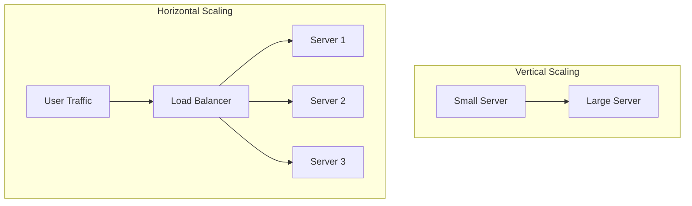
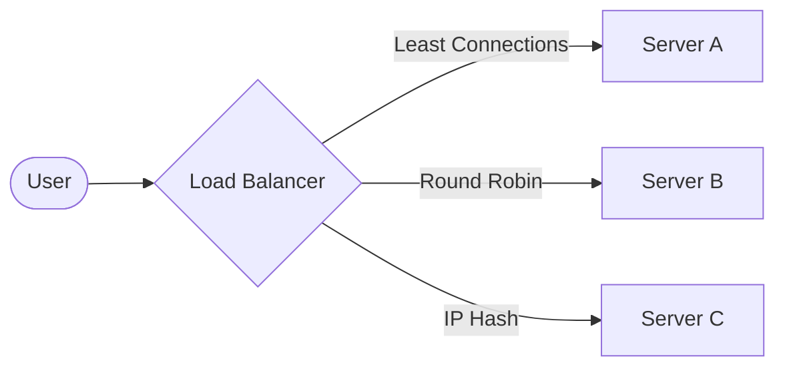

# Part 1 — Fundamentals & Core Architecture 🏗️

> **The foundation of every global-scale system, from Netflix to Amazon.**

---

## 1. Scalability

### 💡 One-Line Definition
The ability of a system to handle **increasing load** (more users, more data) by adding resources.

### 🏢 Real-World Application: Amazon's Prime Day
During Prime Day, traffic to Amazon spikes by 500%+. Amazon uses **Vertical** (bigger machines) and **Horizontal** (more machines) scaling to ensure the website doesn't crash under pressure.

### 🧠 Detailed Technical Explanation
1.  **Vertical Scaling (Scaling UP)**: Increasing the CPU, RAM, or Disk of a single server. 
    *   *Limit*: You eventually hit the hardware ceiling (a machine can only have so much RAM).
2.  **Horizontal Scaling (Scaling OUT)**: Adding more machine instances to a cluster.
    *   *Benefit*: Practically infinite. You just keep adding $10, $1000, or $10,000 servers.

---

## 2. Availability

### 💡 One-Line Definition
The percentage of time a system remains **operational and accessible** to users.

### 🏢 Real-World Application: Google Search
Google aims for "Five Nines" (99.999%) availability. This means they are only allowed **5.26 minutes** of downtime per *year*.

### 🧠 Detailed Technical Explanation
Availability is often measured by SLAs (Service Level Agreements).
*   **99.9% (Three Nines)**: 8.77 hours of downtime/year.
*   **99.99% (Four Nines)**: 52.6 minutes of downtime/year.
*   **99.999% (Five Nines)**: 5.26 minutes of downtime/year.

**Formula**: `Availability = (Total Time - Downtime) / Total Time`

---

## 3. Reliability

### 💡 One-Line Definition
The probability that a system will **perform its intended function** without failure for a specified duration.

### 🏢 Real-World Application: PayPal Payments
If PayPal is "Available" but fails to correctly debit 5% of users (bug), it is **available but not reliable**. Reliability ensures that once you click "Pay," the transaction completes correctly 100% of the time.

### 🧠 Detailed Technical Explanation
*   **Availability**: Can I reach the site?
*   **Reliability**: Does the site do exactly what I expect without errors?
*   **Metric**: Mean Time Between Failures (MTBF).

---

## 4. Latency

### 💡 One-Line Definition
The **time delay** for a single request to travel from the user to the server and back.

### 🏢 Real-World Application: Competitive Gaming (Counter-Strike/Valorant)
In gaming, "Ping" is latency. 20ms = Smooth gameplay. 500ms = "Lag," and the game becomes unplayable even if the "Throughput" is high.

### 🧠 Detailed Technical Explanation
Latency is composed of:
1.  **Propagation Delay**: Speed of light through fiber optics.
2.  **Transmission Delay**: Sending bits over the wire.
3.  **Processing Delay**: The time taken by your Java/Node.js code to process the request.
4.  **Queueing Delay**: Request waiting in a buffer (e.g., at the Load Balancer).

---

## 5. Throughput

### 💡 One-Line Definition
The **number of requests** or the amount of data a system can process in a given time period (e.g., Requests Per Second - RPS).

### 🏢 Real-World Application: Netflix Video Streaming
Netflix needs high **Throughput** to stream 4K video to millions of users simultaneously. It doesn't matter if the first millisecond of video takes 500ms to arrive (Latency), as long as 60MB/second keep arriving (Throughput).

### 🧠 Detailed Technical Explanation
Imagine a water pipe:
*   **Latency**: How long it takes for the *first* drop of water to travel through.
*   **Throughput**: How many *liters* of water flow out per minute.

---

## 6. Capacity

### 💡 One-Line Definition
The **maximum amount** of load, users, or data a system can handle before performance degrades.

### 🏢 Real-World Application: Zoom Meetings
A single Zoom meeting has a capacity of 100-1000 participants depending on the plan. Beyond that, the server CPU hits 100% and video starts lagging.

### 🧠 Detailed Technical Explanation
Capacity Planning involves stress testing a system to find its breaking point and then setting limits (Rate Limiting) or scaling triggers.

---

## 7. Client-Server Architecture

### 💡 One-Line Definition
A model where **Clients** (users/browsers) request resources, and **Servers** (centralized engines) provide them.

### 🏢 Real-World Application: Instagram
Your phone is the **Client**. When you scroll, it asks the Instagram **Servers** for "Next 10 Photos." The Server fetches them from a Database and sends them back.

### 🧠 Detailed Technical Explanation
*   **Client**: Thin (Browser) vs Thick (Desktop app).
*   **Stateless**: The server doesn't "remember" the client between requests (standard for REST).
*   **Communication**: Usually via HTTP/HTTPS over TCP/IP.

---

## 8. Database (The Storage Layer)

### 💡 One-Line Definition
A structured system for **storing, retrieving, and managing** data.

### 🏢 Real-World Application: Uber Rider Data
Uber stores your name, credit card, and ride history in a database. When you open the app, it queries the DB: `SELECT * FROM riders WHERE id = 'saurabh'`.

### 🧠 Detailed Technical Explanation
*   **OLTP (Online Transactional Processing)**: Fast, small operations (e.g., "Add to Cart").
*   **OLAP (Online Analytical Processing)**: Big, slow reports (e.g., "Total revenue last month").

---

## 9. SQL vs NoSQL

### 💡 One-Line Definition
**SQL**: Predefined schema, relational (tables).  
**NoSQL**: Flexible schema, non-relational (documents, key-value).

### 🏢 Real-World Application: E-commerce vs Social Media
*   **SQL (PostgreSQL/MySQL)**: Used for Payments and Orders (ACID compliance needed).
*   **NoSQL (MongoDB/Cassandra)**: Used for Product Reviews or Social Feed (high volume, unpredictable structure).

### 🧠 Detailed Technical Explanation

| Feature | SQL (Relational) | NoSQL (Non-Relational) |
|---------|-----------------|------------------------|
| **Schema** | Fixed (Strict) | Dynamic (Flexible) |
| **Scaling** | Vertical (Mostly) | Horizontal (Built-in) |
| **Relationships** | Joins are efficient | Denormalization needed |
| **Best For** | Banking, ERP, CRM | Real-time, Analytics, Chat |

---

## 10. Load Balancing

### 💡 One-Line Definition
A bridge that **distributes incoming traffic** across multiple servers to prevent any single server from catching fire.

### 🏢 Real-World Application: Google Traffic Manager
When millions of people visit `google.com`, a Load Balancer (like Nginx or HAProxy) routes the user to one of 100,000 servers based on their location and current server load.

### 🧠 Detailed Technical Explanation
**Algorithms**:
1.  **Round Robin**: Server 1 → Server 2 → Server 3...
2.  **Least Connections**: Send request to the server with the fewest active users.
3.  **IP Hash**: Ensure a user always goes to the *same* server (good for sessions).

---

## ✅ Summary Checklist
- [ ] Scalability (Adding juice)
- [ ] Availability (Uptime)
- [ ] Reliability (Accuracy)
- [ ] Latency (Delay)
- [ ] Throughput (Flow)
- [ ] Capacity (Max Limit)
- [ ] Client-Server (The Request/Response)
- [ ] Database (The Memory)
- [ ] SQL vs NoSQL (Fixed vs Flexible)
- [ ] Load Balancing (Traffic Cop)
