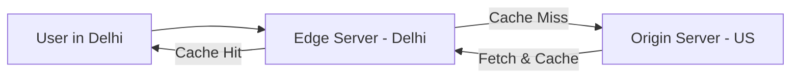

# Part 2 — Performance & API Design 🚀

> **How to optimize for speed, global reach, and developer-friendly APIs.**

---

## 11. Caching

### 💡 One-Line Definition
Storing copies of data in a **fast-access layer** (like RAM) to avoid hitting a slower storage layer (like a Hard Drive or Database).

### 🏢 Real-World Application: Instagram Profile Page
When you visit a famous footballer's profile, Instagram doesn't query the database for their "follower count" every time. They store it in **Redis** (an in-memory cache). The first request takes 200ms (DB), but the next 10,000 requests take only 2ms (Cache).

### 🧠 Detailed Technical Explanation
*   **Write-Through Cache**: Data is written into the cache and DB at the same time.
*   **Write-Back Cache**: Data is written only to the cache first; it's synced to the DB later.
*   **Cache-Aside**: The application first checks the cache. If it's not there (Cache Miss), it fetches from the DB and stores it in the cache for next time.

---

## 12. Cache Invalidation

### 💡 One-Line Definition
The process of **clearing/updating the cache** when the data in the database changes. 

> *"There are only two hard things in Computer Science: cache invalidation and naming things."* — Phil Karlton

### 🏢 Real-World Application: E-commerce Price Change
If you change a product price from $100 to $80 in the DB, but the cache still says $100, users will be angry! You must **invalidate** (delete or update) that specific cache entry during the DB update.

### 🧠 Detailed Technical Explanation
**Strategies**:
1.  **TTL (Time To Live)**: Cache automatically expires after 5 minutes.
2.  **Eviction Policies**:
    *   **LRU (Least Recently Used)**: Kick out the data that hasn't been used in a long time.
    *   **LFU (Least Frequently Used)**: Kick out the data that is used the least overall.

---

## 13. CDN (Content Delivery Network)

### 💡 One-Line Definition
A global network of **edge servers** that cache static assets (images, videos, CSS) geographically closer to users.

### 🏢 Real-World Application: Netflix Thumbnail Images
Netflix has servers in Mumbai, London, and New York. When a user in Mumbai opens Netflix, the movie poster images are served from a **Mumbai edge server**, not from California. This reduces **Latency** drastically.

### 🧠 Detailed Technical Explanation



---

## 14. DNS (Domain Name System)

### 💡 One-Line Definition
The "Phonebook of the Internet" that translates human-readable names (`google.com`) into computer-readable **IP Addresses** (`142.250.190.46`).

### 🏢 Real-World Application: Any Website
When you type `github.com` in your browser, your computer asks a DNS server, "Where is github located?" The DNS server responds, "Go to 140.82.121.4."

### 🧠 Detailed Technical Explanation
1.  **Recursive Resolver**: Your ISP's server.
2.  **Root Nameserver**: The top of the hierarchy.
3.  **TLD Nameserver**: Handles `.com`, `.org`, etc.
4.  **Authoritative Nameserver**: The final source of truth for a specific domain.

---

## 15. API Design

### 💡 One-Line Definition
The process of defining how different software components **talk to each other** (endpoints, methods, payloads).

### 🏢 Real-World Application: Stripe Payment Gateway
Stripe has the world's most famous API design. Their endpoints like `POST /v1/charges` are so clear and well-documented that any developer can integrate payments in 10 minutes.

### 🧠 Detailed Technical Explanation
**Principles**:
*   **Backward Compatibility**: New changes shouldn't break old apps (Versioning).
*   **Consistency**: Use the same naming conventions (e.g., `camelCase` for all keys).
*   **Documentation**: Essential for developer adoption.

---

## 16. REST (Representational State Transfer)

### 💡 One-Line Definition
An architectural style that uses **standard HTTP methods** and is **Stateless**.

### 🏢 Real-World Application: Twitter/X
`GET /users/saurabh` fetches user data.  
`POST /tweets` creates a new tweet.  
`DELETE /tweets/123` removes a specific tweet.

### 🧠 Detailed Technical Explanation
*   **Resource-Based**: Everything is a "resource" identified by a URL.
*   **Methods**: GET (Read), POST (Create), PUT (Update), DELETE (Delete).
*   **Format**: Usually returns JSON.

---

## 17. GraphQL

### 💡 One-Line Definition
A query language for APIs that allows clients to **ask for exactly the data they need** (nothing more, nothing less).

### 🏢 Real-World Application: Facebook Mobile App
Facebook has massive user objects. On a profile page, you might need 20 fields, but on a search result, you only need 2. GraphQL avoids **Over-fetching** (sending too much data) and **Under-fetching** (not sending enough data).

### 🧠 Detailed Technical Explanation
*   **Single Endpoint**: Unlike REST (many URLs), GraphQL uses one URL (usually `/graphql`).
*   **Schema**: A strict typed definition of what data exists.
*   **Query Example**:
    ```graphql
    query {
      user(id: "1") {
        name
        profileImage
      }
    }
    ```

---

## 18. gRPC (Google Remote Procedure Call)

### 💡 One-Line Definition
A high-performance framework that uses **Protocol Buffers** (binary data) instead of JSON for extremely fast communication.

### 🏢 Real-World Application: Microservices at Uber
When you order an Uber, 50 different microservices (Map, Payment, Driver, Promo) talk to each other. They use **gRPC** because it is 7-10x faster than REST and uses less bandwidth.

### 🧠 Detailed Technical Explanation
*   **HTTP/2**: Uses advanced features like bi-directional streaming.
*   **Protobuf**: Stores data in a compact binary format.
*   **Code Generation**: Automatically creates client/server code in 10+ languages.

---

## 19. API Gateway

### 💡 One-Line Definition
A single point of entry that acts as a **"Security and Traffic Guard"** for all your microservices.

### 🏢 Real-World Application: Netflix Zuul
When you click a movie on Netflix, the request first hits the **API Gateway**. It checks your auth-token, routes you to the "Movie-Service," and records logs.

### 🧠 Detailed Technical Explanation
Responsibilites:
1.  **Authentication**: Identifying the user.
2.  **Rate Limiting**: Preventing spam.
3.  **Routing**: Mapping URLs to specific backend services.
4.  **Logging & SSL Termination**: Centralized management.

---

## 20. Service Discovery

### 💡 One-Line Definition
A mechanism that helps services **automatically find the location (IP/Port)** of other services in a dynamic cluster.

### 🏢 Real-World Application: Kubernetes (K8s)
In a cloud environment, servers (pods) are deleted and created every second. If "Service A" needs to talk to "Service B," it can't hardcode an IP address. It asks a **Service Registry** (like Consul or Kubernetes DNS), "Where is Service B currently?"

### 🧠 Detailed Technical Explanation
*   **Client-Side Discovery**: The client queries the registry and picks an IP.
*   **Server-Side Discovery**: The client hits a load-balancer which handles the registry query.

---

## ✅ Summary Checklist
- [ ] Caching (Speed layer)
- [ ] Cache Invalidation (Keeping it fresh)
- [ ] CDN (Edge servers)
- [ ] DNS (The phonebook)
- [ ] API Design (Clear interfaces)
- [ ] REST (The standard)
- [ ] GraphQL (Custom query)
- [ ] gRPC (Extreme performance)
- [ ] API Gateway (The gatekeeper)
- [ ] Service Discovery (The directory)
