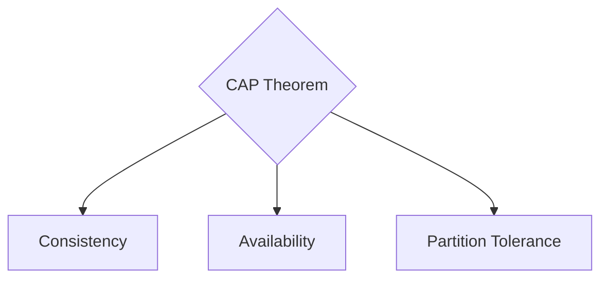

# Part 3 — Reliability & Security Patterns 🛡️

> **How to protect your system from attackers and keep it running during massive outages.**

---

## 19. Authentication (AuthN)

### 💡 One-Line Definition
The process of proving **who you are** (e.g., verifying a username and password).

### 🏢 Real-World Application: Google Login
When you sign in to Gmail, Google asks for your password or biometric (AuthN). If successful, you get a "Token" (like a JWT) that says, "This is Saurabh."

### 🧠 Detailed Technical Explanation
*   **Knowledge-Based**: Something you know (Passwords, Pins).
*   **Ownership-Based**: Something you have (Phone, Security Key).
*   **Inherence-Based**: Something you are (FaceID, Fingerprint).
*   **JWT (JSON Web Token)**: A stateless, encoded string used for scaling auth in microservices.

---

## 20. Authorization (AuthZ)

### 💡 One-Line Definition
The process of determining **what you are allowed to do** (e.g., can you delete a post?).

### 🏢 Real-World Application: Google Docs
Even if you are "Authenticated" as a Google user, you can't edit your friend's document unless they have given you **Permisson** (AuthZ).

### 🧠 Detailed Technical Explanation
*   **RBAC (Role-Based Access Control)**: User has a "Role" (Admin, Editor, Viewer).
*   **ABAC (Attribute-Based Access Control)**: Permission based on time, location, or department.

---

## 21. Rate Limiting

### 💡 One-Line Definition
The practice of **limiting the number of requests** a user/IP can make in a given time period to prevent spam and system crashes.

### 🏢 Real-World Application: OpenAI API (ChatGPT)
If you try to call the ChatGPT API 1,000 times in 1 second, you'll see a `429 Too Many Requests` error. This is **Rate Limiting** in action to protect the servers.

### 🧠 Detailed Technical Explanation
**Algorithms**:
1.  **Token Bucket**: If the bucket is empty, wait for a new token to be added.
2.  **Leaky Bucket**: Requests flow out at a constant, fixed rate.
3.  **Fixed Window**: User can make X requests every 60 seconds (resets precisely at 0:01).

---

## 22. Fault Tolerance

### 💡 One-Line Definition
A design principle that allows a system to **continue operating correctly** even if some of its components fail.

### 🏢 Real-World Application: Netflix Chaos Monkey
Netflix has a tool that **randomly kills servers** in their production environment. The system is designed to be **Fault Tolerant** so that movies keep playing even if a whole server farm goes down.

### 🧠 Detailed Technical Explanation
Achieved through **Redundancy** (having backups) and **Graceful Degradation** (showing a simpler version of the app when a service is down).

---

## 23. High Availability (HA)

### 💡 One-Line Definition
A system design that ensures a high level of **uptime** across different data centers and regions.

### 🏢 Real-World Application: AWS US-East-1 vs US-West-2
If an entire data center in Virginia crashes (US-East-1), a **High Availability** app will immediately switch to servers in Oregon (US-West-2).

### 🧠 Detailed Technical Explanation
*   **Active-Passive**: One server works, another waits for failure.
*   **Active-Active**: All servers share the load at all times.

---

## 24. CAP Theorem

### 💡 One-Line Definition
A mathematical proof that a distributed system can only provide two out of three: **Consistency**, **Availability**, and **Partition Tolerance**.

### 🏢 Real-World Application: Pinterest vs Banking
*   **Availability + Partition Tolerance (AP)**: Pinterest shows you pins, even if the count is slightly wrong.
*   **Consistency + Partition Tolerance (CP)**: Your Bank shows "Error" instead of showing you the wrong balance.

### 🧠 Detailed Technical Explanation
*   **C (Consistency)**: All nodes see the same data at the same time.
*   **A (Availability)**: Every request receives a response (even if it's old data).
*   **P (Partition Tolerance)**: The system works even if network cables between servers are cut.

---

## 25. Consistency Models

### 💡 One-Line Definition
The rules that define how and when **data updates** are visible to different users across multiple servers.

### 🏢 Real-World Application: Facebook Likes
When you "Like" a post, your friend might see "10 Likes" while you see "11 Likes" for a few seconds. This is **Eventual Consistency**.

### 🧠 Detailed Technical Explanation
1.  **Strong Consistency**: All users see the new data *immediately* (Slow).
2.  **Eventual Consistency**: All nodes will *eventually* agree, but there's a delay (Fast).
3.  **Causal Consistency**: If I reply to a tweet, everyone sees the tweet *before* they see my reply.

---

## 41. Circuit Breaker

### 💡 One-Line Definition
A pattern that **stops requests** to a failing service automatically to prevent "Cascading Failures."

### 🏢 Real-World Application: Amazon Prime Video Recommendations
If the "AI Recommendation Service" starts failing, the **Circuit Breaker** (like Netflix Hystrix) "Opens." Instead of the whole page lagging and crashing, it simply shows "Trending Today" instead of personalized picks.

### 🧠 Detailed Technical Explanation
**States**:
1.  **Closed**: Everything is normal.
2.  **Open**: Service is failing. Don't even try to call it!
3.  **Half-Open**: Try one small request to see if the service is back up.

---

## 42. Bulkhead

### 💡 One-Line Definition
A pattern that **isolates resources** (threads, CPU, pods) so that a failure in one area doesn't drain the entire system's resources.

### 🏢 Real-World Application: Ship Design
Ships have "Bulkheads" (walls). If one part of the ship floods, the water is trapped in that section, and the ship keeps floating. Similarly, in an app, the "Payment Service" and any "Image Upload" service have separate **Thread Pools**.

### 🧠 Detailed Technical Explanation
If the "Image Upload" service gets 1 million slow requests, it shouldn't take up the threads used for "Payments," or users won't be able to buy anything!

---

## 43. Retry Logic & 44. Timeout

### 💡 One-Line Definition
**Timeout**: Giving up after a fixed time.  
**Retry**: Trying the request again.

### 🏢 Real-World Application: Gmail Mobile App
When you send an email on a shaky 5G connection, the app **Tries again** (Retry) if the first attempt **Timed out** after 10 seconds. 

### 🧠 Detailed Technical Explanation
**Exponential Backoff**: Don't retry immediately! Wait 1s, then 2s, then 4s, then 8s. Adding **Jitter** (a random small delay) prevents all devices from retrying at the exact same millisecond and crashing the server again.

---

## ✅ Summary Checklist
- [ ] Authentication (Proof of identity)
- [ ] Authorization (Manager permissions)
- [ ] Rate Limiting (Traffic speed gun)
- [ ] Fault Tolerance (Healing powers)
- [ ] High Availability (No downtime)
- [ ] CAP Theorem (The big trade-off)
- [ ] Consistency Models (Data sync rules)
- [ ] Circuit Breaker (The fuse box)
- [ ] Bulkhead (Isolation walls)
- [ ] Retry/Timeout (Trying again smarter)
