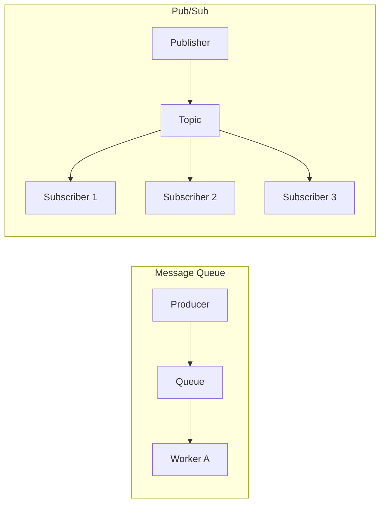

# Part 5 — Microservices & Event-Driven Patterns 🧩

> **Moving from "One Big App" to "Many Small Apps" that talk to each other efficiently.**

---

## 33. Microservices vs 34. Monolith

### 💡 One-Line Definition
**Monolith**: All application logic is in one codebase/unit.  
**Microservices**: Application logic is broken into small, independent services.

### 🏢 Real-World Application: Early Facebook vs Modern Amazon
*   **Monolith**: Early Facebook was one giant PHP file. It was easy to build, but if one bug in "Photo Upload" crashed, the "Search" and "Feed" also died.
*   **Microservices**: Amazon has thousands of small services. The "Cart Service," "Order Service," and "Price Service" are all independent. If the "Recommendations" service dies, you can still buy items.

### 🧠 Detailed Technical Explanation
*   **Monolith**: Single DB, single deployment, easier testing. Hard to scale specific parts.
*   **Microservices**: Multiple DBs, separate scaling, uses API calls to communicate. Complex to manage.

---

## 35. Event-Driven Architecture (EDA)

### 💡 One-Line Definition
A design pattern where services react to **"Events"** (state changes) instead of waiting for direct commands.

### 🏢 Real-World Application: Food Delivery (Zomato/UberEats)
When you click **"Place Order"**, an event is published: `ORDER_PLACED`. 
1.  **Payment Service** "hears" it and charges you.
2.  **Restaurant Service** "hears" it and starts cooking.
3.  **Analytics Service** "hears" it for a report. 
None of these call each other directly; they all react to the same event.

### 🧠 Detailed Technical Explanation
*   **Producer**: The service that creates the event.
*   **Consumer**: The service that listens/reacts.
*   **Broker**: The middleman (Kafka/RabbitMQ) that holds the events.

---

## 36. Message Queue (MQ) vs 37. Pub/Sub

### 💡 One-Line Definition
**MQ**: Point-to-point. One message is consumed by **one** worker (e.g., RabbitMQ).  
**Pub/Sub**: One message is broadcasted to **many** listeners (e.g., Redis PubSub/Kafka).

### 🏢 Real-World Application: Video Upload
*   **MQ**: You upload a video. A **Message Queue** assigns the "Transcode" task to one available server.
*   **Pub/Sub**: You upload a post. Multiple listeners hear it: "Notification Service" send a push, "Timeline Service" update the feed, and "Email Service" send a summary.

### 🧠 Detailed Technical Explanation

---

## 38. Sync vs Async Communication

### 💡 One-Line Definition
**Sync**: Request waits for a response (blocking).  
**Async**: Request happens, and the response comes whenever it's ready (non-blocking).

### 🏢 Real-World Application: Phone Call vs WhatsApp
*   **Sync (REST/gRPC)**: You call someone. You both have to be on the line at the same time. "Are you free for lunch?" "Yes."
*   **Async (Kafka/Webhooks)**: You send a WhatsApp message. You go about your day. The other person replies 10 minutes later.

---

## 39. Idempotency

### 💡 One-Line Definition
Ensuring that performing an operation **multiple times** has the same result as performing it once.

### 🏢 Real-World Application: Payment "Retry"
Your internet disconnects while you click **"Proceed to Pay"**. You click it again. **Idempotency** ensures that Amazon/Stripe doesn't charge you twice, even if they received two identical requests.

### 🧠 Detailed Technical Explanation
Usually achieved by a **Unique Request ID (Idempotency Key)**. If the server sees the same key again, it returns the *previous* result instead of doing the work again.

---

## 40. Backpressure

### 💡 One-Line Definition
A signal from a **Consumer** saying: "Stop! You are sending data too fast, I can't handle it!"

### 🏢 Real-World Application: High Traffic Log Streams
If a server generates 100,000 logs/second but the database can only write 10,000/second, the DB will crash. **Backpressure** tells the log producer to slow down or buffer the data until the DB catches up.

---

## 73. CQRS (Command Query Responsibility Segregation)

### 💡 One-Line Definition
Separating the models for **Writing** (Command) from the models for **Reading** (Query) data.

### 🏢 Real-World Application: Amazon Search
*   **Write (SQL)**: When you buy a product, it goes into a strict PostgreSQL DB. 
*   **Read (Elasticsearch)**: When you search for "Nike Shoes," it queries a different DB (Elasticsearch) that is flattened and optimized for search speed.

### 🧠 Detailed Technical Explanation
A background process (like Kafka) syncs the data from the Write DB to the Read DB. This allows the Read side to be scaled horizontally while keeping the Write side consistent.

---

## 74. Event Sourcing

### 💡 One-Line Definition
Instead of storing the **current state**, you store the **entire history of changes (events)** as the source of truth.

### 🏢 Real-World Application: Banking Passbook
A database usually stores your balance: `$500`. **Event Sourcing** stores: `+1000, -200, -300`. To find the current balance, you sum the events. If an error happens, you can "replay" events to see exactly where the count went wrong.

---

## ✅ Summary Checklist
- [ ] Monolith vs Microservices (Big vs Small)
- [ ] Event-Driven (React to triggers)
- [ ] Message Queue vs Pub/Sub (Single vs Multiple receivers)
- [ ] Sync vs Async (Blocking vs Non-blocking)
- [ ] Idempotency (Repeatable safety)
- [ ] Backpressure (Flow control)
- [ ] CQRS (Separate Reading/Writing)
- [ ] Event Sourcing (The full history)
