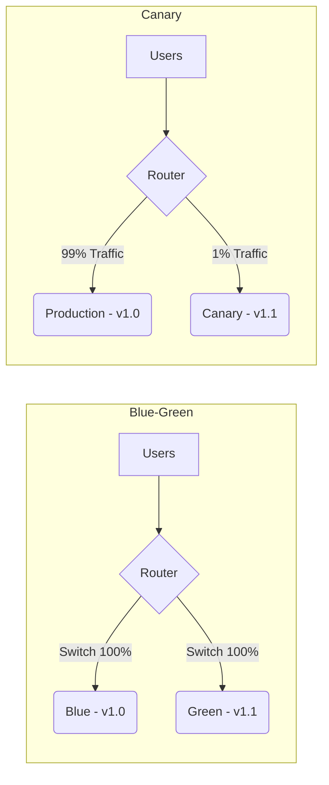

# Part 6 — Ops, Deployment & Observability ⚙️

> **How to launch, scale, and monitor your backend like a Netflix engineer.**

---

## 47. Load Shedding

### 💡 One-Line Definition
Intentionally **dropping low-priority requests** to keep the server alive for high-priority ones during a traffic spike.

### 🏢 Real-World Application: Google Search vs Ads
If Google's servers are at 100% CPU, they might stop showing "Personalized News Recommendations" (Low Priority) so that "Google Search" and "Ad Clicks" (High Priority) keep working perfectly.

### 🧠 Detailed Technical Explanation
A middle layer (like an API Gateway) checks the system load. If it's too high, it returns a `503 Service Unavailable` for background tasks (analytics, non-critical fetches) but allows critical transactions to pass.

---

## 48. Autoscaling

### 💡 One-Line Definition
Automatically **adding or removing servers** based on current traffic (CPU/RAM usage).

### 🏢 Real-World Application: Disney+ Hotstar during IPL
During a cricket match, viewers might jump from 1 million to 10 million in 10 minutes. **Autoscaling** detects the CPU spike and boots up 500 new servers automatically in the background. When the match ends, it shuts them down to save money.

---

## 49. Blue-Green vs 50. Canary Release

### 💡 One-Line Definition
**Blue-Green**: Switching 100% of traffic from the old version (Blue) to the new version (Green) instantly.  
**Canary**: Releasing the new version to only 1% of users first to test for bugs.

### 🏢 Real-World Application: Instagram Updates
*   **Blue-Green**: If the update is simple (e.g., a bug fix).
*   **Canary**: If the update adds a massive feature (e.g., "Meta AI"). Instagram shows it to 1,000 users in New Zealand first. If it doesn't crash, they scale to 10%, 50%, then 100%.

### 🧠 Detailed Technical Explanation

---

## 51. Feature Flags

### 💡 One-Line Definition
A "Toggle" in your code that allows you to **turn features ON or OFF** without redeploying the app.

### 🏢 Real-World Application: Amazon Checkout
Imagine Amazon wants to test a "New One-Click Checkout" button. They keep the code in production but set a **Feature Flag** to `false`. They can remotely change it to `true` for specific beta testers or regions instantly.

---

## 52. Observability (53. Logging, 54. Metrics, 55. Tracing)

### 💡 One-Line Definition
The ability to understand the **internal state** of a system by looking at the data it generates.

### 🧠 The Three Pillars:
1.  **Logging**: Recording discrete events (e.g., "User ID 5 logged in"). (ELK Stack / Splunk).
2.  **Metrics**: Aggregated numbers over time (e.g., "Current CPU is 45%"). (Prometheus / Grafana).
3.  **Tracing**: Tracking a single request as it travels through 10 different microservices (e.g., "Order request → Payment → Shipping"). (Jaeger / Zipkin).

---

## 56. Correlation ID

### 💡 One-Line Definition
A unique **string/ID** assigned to a request at the gateway that is passed to every internal microservice it touches.

### 🏢 Real-World Application: Troubleshooting a Failed Order
If a user says, "My payment failed," you search for that specific **Correlation ID** in your logging dashboard. You can see the logs for that *exact* request across the Payment Service, Order Service, and DB logs combined.

---

## 57. Monitoring vs 58. Alerting

### 💡 One-Line Definition
**Monitoring**: "What is happening now?" (Watching the dashboard).  
**Alerting**: "Tell someone that something is broken!" (Sending a Slack/PagerDuty notification).

### 🏢 Real-World Application: Uber Site Reliability
*   **Monitoring**: A Grafana dashboard showing "Wait times for cabs in Bangalore."
*   **Alerting**: If "Average Wait Time" exceeds 15 minutes, an **Alert** is sent to the on-call engineer's phone to investigate.

---

## ✅ Summary Checklist
- [ ] Load Shedding (Dropping low-priority)
- [ ] Autoscaling (Booting servers on-demand)
- [ ] Blue-Green vs Canary (Deployment strategies)
- [ ] Feature Flags (Remote toggles)
- [ ] Logging, Metrics, Tracing (The big three)
- [ ] Correlation ID (Tracking across services)
- [ ] Monitoring vs Alerting (Watching vs Responding)
