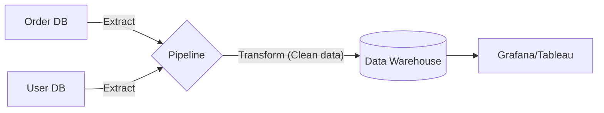

# Part 7 — Advanced Data Processing 📊

> **How to search, analyze, and pipeline massive amounts of data for production.**

---

## 59. Full-Text Search

### 💡 One-Line Definition
A technique to search for **words or phrases** inside unstructured text quickly using an "Inverted Index."

### 🏢 Real-World Application: Amazon Search
When you search for "Blue Nike Shoes for Men," Amazon doesn't look row by row. It uses **Elasticsearch** or **Algolia**. It knows exactly which 10 products contain the word "Nike" and "Men" instantly by looking at its **Inverted Index**.

---

## 60. Time Series Database (TSDB)

### 💡 One-Line Definition
A database optimized for storing **data points indexed by time** (measurements, stats, logs).

### 🏢 Real-World Application: Stock Market Apps (Zerodha/Upstox)
Apps need to store the price of Apple stock every millisecond. Instead of a normal SQL DB, they use **InfluxDB** or **Prometheus**, which can store millions of price points and show you a "1-Year Chart" in milliseconds.

---

## 61. Vector DB

### 💡 One-Line Definition
A database that stores data as **mathematical vectors** (embeddings) to allow for "Similarity Search" (useful for AI/LLMs).

### 🏢 Real-World Application: ChatGPT / Recommendation Systems
When you ask an AI a question, it uses a **Vector DB** (like Pinecone or Milvus) to find the "closest matching" pieces of information based on **Meaning**, not just matching keywords.

---

## 62. Materialized View

### 💡 One-Line Definition
A **pre-calculated result** of a slow query that is stored as a physical table for instant reading.

### 🏢 Real-World Application: Monthly Sales Report
To calculate "Total Sales of 2024," you have to sum 10 million rows. This takes 30 seconds. A **Materialized View** calculates this once and saves the answer. Now, when you open the report, it loads in 0.01 seconds.

---

## 63. Query Optimization & 64. Connection Pooling

### 💡 One-Line Definition
**Optimization**: Making SQL queries faster through better indexes and structure.  
**Connection Pooling**: Reusing a fixed number of **database connections** instead of opening a new one for every user (extremely fast!).

### 🏢 Real-World Application: High Traffic Apps
Imagine 10,000 users arrive. If your app opens 10,000 separate DB connections, the DB will crash. A **Pool** allows those 10,000 users to share 100 existing connections, saving time and RAM.

---

## 84. MapReduce

### 💡 One-Line Definition
A programming model for processing **vast amounts of data** (Petabytes) in parallel across thousands of servers.

### 🏢 Real-World Application: Google Search Indexing
In the early days, Google used **MapReduce** to count every word on every website on the internet. 
1.  **Map**: Count words on one page (Task split into 1,000 servers).
2.  **Reduce**: Combined the counts from all 1,000 servers into a single total list.

---

## 85. Batch vs 86. Stream Processing

### 💡 One-Line Definition
**Batch**: Processing data in big chunks (e.g., "Run tonight at 2 AM").  
**Stream**: Processing every data point **instantly** as it arrives (e.g., "Real-time Fraud detection").

### 🏢 Real-World Application: Banking
*   **Batch**: Your bank statement being generated once a month.
*   **Stream (Kafka Streams/Flink)**: If your credit card is swiped in London and Tokyo in the same hour, a **Stream Processor** identifies the **Fraud** in 1 second.

---

## 87. ETL (Extract, Transform, Load) & 88. Data Pipelines

### 💡 One-Line Definition
**ETL**: Extracting data from multiple sources, changing it into a standard format (Transform), and loading it into a Data Warehouse.  
**Data Pipeline**: The automated "Pipe" that moves this data from Point A to Point B.

### 🧠 Modern Example: E-commerce Analytics

---

## ✅ Summary Checklist
- [ ] Full-Text Search (Elasticsearch)
- [ ] Time Series (Charts & Logs)
- [ ] Vector DB (AI & Meaning)
- [ ] Materialized View (Pre-calculated results)
- [ ] Query Opt & Connection Pooling (DB Tuning)
- [ ] MapReduce (Divide & Conquer)
- [ ] Batch vs Stream Processing (Chunks vs Instant)
- [ ] ETL & Pipelines (Moving and cleaning data)
