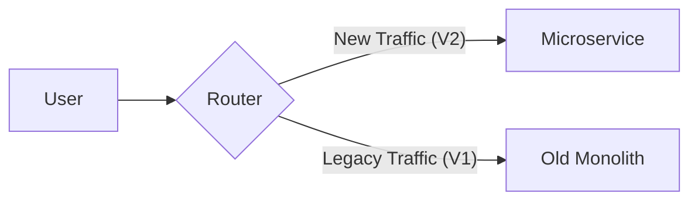

# Part 8 — Data Strategy & Networking 🔌

> **How to store petabytes of data and manage real-time communication between services.**

---

## 89. Data Lake vs 90. Data Warehouse

### 💡 One-Line Definition
**Data Warehouse**: Storing massive amounts of **Highly Structured** data for analytics (SQL-based).  
**Data Lake**: Storing massive amounts of **Raw/Unstructured** data (images, logs, JSON) for later use.

### 🏢 Real-World Application: Amazon Data Analytics
*   **Data Lake (S3)**: Amazon stores every raw log from every server and every click from every user. It’s cheap and fast to store, but messy.
*   **Data Warehouse (Redshift)**: Every midnight, a "Clean" version of the sales data is loaded here. This allows the CEO to ask: "What was the total profit in New York yesterday?" instantly.

### 🧠 Detailed Technical Explanation
*   **ETL (Extract, Transform, Load)**: Use for Data Warehouse.
*   **ELT (Extract, Load, Transform)**: Use for Data Lake (transform only when you need to read).

---

## 68. Data Compression

### 💡 One-Line Definition
Reducing the size of data to save **bandwidth** and **storage space**.

### 🏢 Real-World Application: Image Uploads
When you upload an image to Instagram, the backend **compresses** it using algorithms like `JPEG` or `WebP`. This ensures the image loads fast for your followers and Instagram doesn't pay millions in extra storage bills.

---

## 69. Serialization & 70. Deserialization

### 💡 One-Line Definition
**Serialization**: Converting an object in your code (e.g., a User object) into a **Format for transmission** (JSON, XML, Binary).  
**Deserialization**: Converting that format back into a **Code object** on the receiving side.

### 🏢 Real-World Application: API Communication
In your Java code, you have a `user` object. You **Serialize** it to a JSON string: `{"name": "Saurabh"}` to send it over the network. The React/Android client **Deserializes** that string back into a JavaScript/Kotlin object.

---

## 71. WebSockets vs 72. WebRTC

### 💡 One-Line Definition
**WebSockets**: Bi-directional, long-lived connection for **Real-time Data** (Text/JSON).  
**WebRTC**: Peer-to-peer connection for **Real-time Media** (Video/Audio).

### 🏢 Real-World Application: WhatsApp Chat vs Call
*   **WebSockets**: Used for the **Chat** part. "Is he typing?" "New message received!" (Client ↔ Server).
*   **WebRTC**: Used for the **Video Call**. The video data travels **Directly** from your phone to your friend's phone to avoid the latency of a central server.

---

## 75. Service Mesh & 76. Sidecar Pattern

### 💡 One-Line Definition
**Service Mesh**: A dedicated "Infrastructure Layer" (like **Istio**) for managing service-to-service communication, security, and observability.  
**Sidecar**: A separate container (e.g., **Envoy Proxy**) that runs alongside your main app container to handle networking tasks.

### 🏢 Real-World Application: E-commerce Microservices
If you have 1,000 services, you don't want every service to write its own "Authentication" or "Retry" logic. A **Service Mesh** puts a **Sidecar** next to every service. The Sidecar handles all retries, encryption, and logs automatically.

---

## 77. BFF (Backend for Frontend)

### 💡 One-Line Definition
A pattern where different frontends (iOS, Android, Web) have their own **Customized Backend** layer to avoid slow loading.

### 🏢 Real-World Application: Netflix UI
The **Netflix TV App** has a different UI than the **Netflix Mobile App**. Instead of the mobile app calling 20 different generic APIs, it calls its own **BFF**. The BFF gathers all 20 pieces of data and sends one "Compact" package optimized for mobile data speeds.

---

## 78. Strangler Pattern

### 💡 One-Line Definition
A strategy to **migrate a Monolith to Microservices** by slowly "Strangling" the old system with new services until nothing is left of the old system.

### 🏢 Real-World Application: Banking Modernization
A Bank can't shut down its 20-year-old Monolith overnight. Instead, they use the **Strangler Pattern**. They build the "New Payment Service" separately. They route 1% of traffic to it. Slowly, they move "Account Service," "Transfer Service," etc. Eventually, the Monolith is retired.

---

## ✅ Summary Checklist
- [ ] Data Lake (Raw storage)
- [ ] Data Warehouse (Clean analytics)
- [ ] Compression (Saving space)
- [ ] Serialization (Converting data)
- [ ] WebSockets (Real-time chat)
- [ ] WebRTC (Real-time video)
- [ ] Service Mesh & Sidecar (Network infrastructure)
- [ ] BFF (Mobile-specific APIs)
- [ ] Strangler Pattern (Slow migration)
