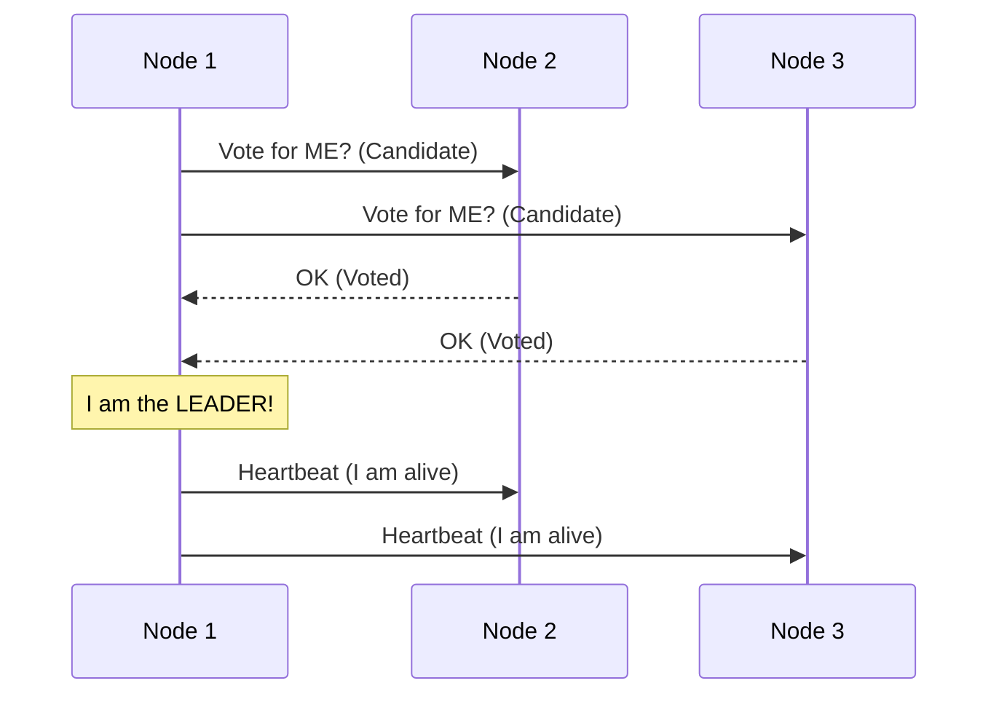

# Part 9 — Security, Distributed Systems & Consensus 🔐

> **How distributed servers agree on reality and keep your data safe.**

---

## 91. Secrets Management

### 💡 One-Line Definition
The process of storing and managing **confidential data** (API Keys, DB Passwords, Certificates) securely outside of source code.

### 🏢 Real-World Application: HashiCorp Vault / AWS Secrets Manager
Never store your `STRIPE_API_KEY` in `config.js` or GitHub! Your app should call a **Secrets Manager** at runtime. The Secrets Manager verifies the app's identity and provides the key instantly.

---

## 92. RBAC (Role-Based Access Control)

### 💡 One-Line Definition
A security model where access is granted based on **User Roles** (e.g., "Interns" can read, but only "Admins" can delete).

### 🏢 Real-World Application: Google Workspace Admin
An IT admin can grant you the "Editor" role for specific files. This avoids managing permissions for 10,000 employees individually. You just manage the **Roles**.

---

## 93. SSO (Single Sign-On)

### 💡 One-Line Definition
A service that allows users to **log in once** and access multiple independent systems without re-entering credentials.

### 🏢 Real-World Application: "Login with Google"
When you use "Login with Google" on Airbnb, Spotify, and TikTok, you are using **SSO**. You don't have 10 messy passwords; you have one secure identity managed by Google.

---

## 94. Encryption (At-Rest & In-Transit)

### 💡 One-Line Definition
**At-Rest**: Encrypting data stored on disks (e.g., Database data).  
**In-Transit**: Encrypting data while it travels over the web (e.g., HTTPS).

### 🏢 Real-World Application: WhatsApp End-to-End Encryption
When you send a message, it is **Encrypted In-Transit**. Even if a hacker intercepts the signal, they only see gibberish. Only the receiver has the key to "Decrypt" it.

---

## 95. Checksum & 96. Erasure Coding

### 💡 One-Line Definition
**Checksum**: A small "Fingerprint" used to verify if a file was corrupted during transfer.  
**Erasure Coding**: A technique to reconstruct **missing or corrupted data** by storing "Parity" data across multiple servers.

### 🏢 Real-World Application: Large File Downloads
When you download a 10GB game, the downloader uses a **Checksum** to ensure not a single bit was flipped by a bad router. If a whole hard drive in an AWS data center dies, **Erasure Coding** (RAID-like) allows the system to rebuild the lost data from other disks.

---

## 97. Consensus & 98. Leader Election

### 💡 One-Line Definition
**Consensus**: A process where a group of independent servers **agree on a single value** (e.g., "Is User A's balance $50?").  
**Leader Election**: Automatically choosing **one server to be the boss** (Leader) while others follow.

### 🏢 Real-World Application: Raft / Paxos / Zookeeper
In a distributed database (like CockroachDB), if the "Leader" node dies, the remaining nodes start an **Election**. They vote, and once they reach **Consensus**, a new Leader is chosen, and the database resume operations instantly.

---

## 65. Cache Stampede, 66. Cache Warming, 67. CDN Caching

### 💡 One-Line Definition
**Stampede**: When a popular cache entry expires and **1,000,000 users** hit the DB at once (crashing it).  
**Warming**: Pre-filling the cache **before** a big launch (like a movie release).  
**CDN Caching**: Caching data at the edge server (near the user) rather than the origin server.

### 🏢 Real-World Application: Marvel Movie Trailer Launch
Before the "Avengers" trailer goes live, Disney **Warms the cache** (loads the video into 100,000 CDN servers). This prevents a **Cache Stampede** where millions of hits might crash the central storage service.

---

## ✅ Summary Checklist
- [ ] Secrets Management (Safety first)
- [ ] RBAC (Permissions by Role)
- [ ] SSO (One login for all)
- [ ] Encryption (At-rest & In-transit)
- [ ] Checksum (Integrity check)
- [ ] Consensus & Leader Election (Raft/Paxos)
- [ ] Cache Warming & Stampede (Managing surges)
- [ ] Distributed Consensus (Agreement in the cluster)

---

# 🏁 Final Masterclass Summary

Congratulations! You have covered **98 core concepts** of backend and system design. 

### 🚀 Next Steps:
1.  **Case Studies**: Try applying these concepts to "How would I build Instagram?" or "How would I build Uber?"
2.  **Coding**: Implement a **Rate Limiter** or a **Circuit Breaker** in your favorite language.
3.  **Interview Ready**: Review the "Real-World Realizations" in each part before your next technical round.
